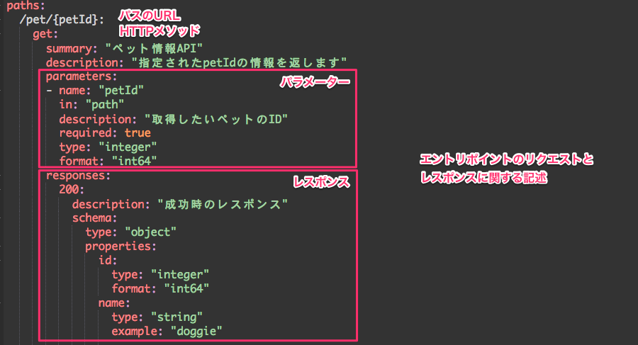
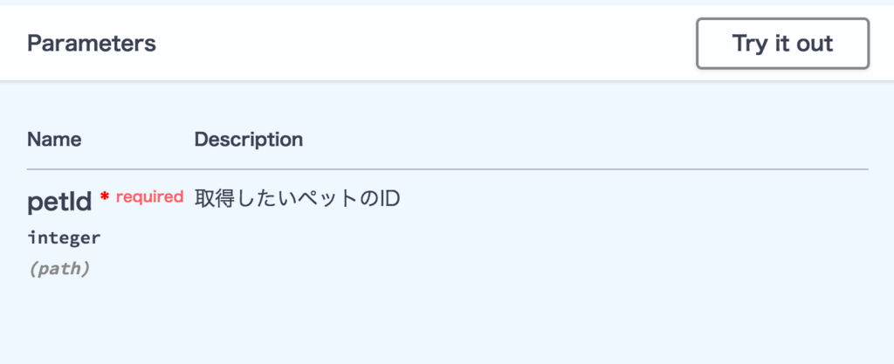
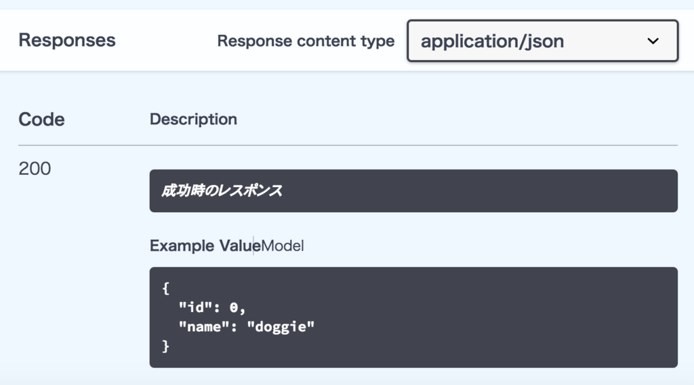

# API仕様書

## 概要

本プロジェクトでは`OpaneAPI`仕様に則り、ツールは`Swagger`を使って作成／管理を行います。  
そのほかのツールとしては`API Blueprint`等も有名ですが、今回はGitBookとの親和性も考慮して`Swagger`を採用します。  
以下にAPI仕様書の記載ルールを説明します。  

## OpenAPI

OpenAPIとは、RESTful APIを記述するためのフォーマットのこと。  
Swagger 2.0を拡張して実装されています。

## Swagger

Swaggerとは、OpenAPIを用いてREST APIを設計する際に使用するツールセットのこと。  
ツールとしてメジャーなものは以下

|ツール名|概要|
|:---|:---|
|Swagger Editor|ブラウザベースでOpenAPIを記述できるエディター。Dockerイメージも配布されており、ローカルでの実行も可能。|
|Swagger UI|OpenAPIの記述を、動的にAPIドキュメントとしてレンダリングするツール。上記のSwagger Editorの右半分に出ているのはコレ。|
|Swagger Codegen|OpenAPIで記載された設計からAPIのスタブを自動生成するツール|

## 記述形式
OpenAPIの記述は以下の2種類から選択可能。  
どちらの形式で記述しても、アウトプットは同じです。  
また`YAML`→`JSON`、`JSON`→`YAML`の相互変換が可能。(Swagger Editorの機能)

-YAML形式  
-JSON形式

本プロジェクトは`YAML`形式での記載とします。

## 作成方法
ドキュメントの生成は`Swagger Editor`を使用します。作成方法は専用のWEBサイト、専用WEBサイトをスタンドアローンで構築、サードパーティー性ツール（VSCode+Swagger Viewer)、などいくつかありますが、まったく準備が必要ない専用のWEBサイトを用いて作成すれば良いと思います。

## 基本の記述
初めにSwagger YAMLを記述するにあたり必須である`swagger`, `info`, `paths`について説明します。  
上記の基本的な構成で記述したシンプルなSwagger YAMLがこちらです。

~~~
swagger: "2.0"
info:
  description: "これはペットストアに関するAPIです。"
  version: "1.0.0"
  title: "Petstore API"
  termsOfService: "http://swagger.io/terms/"
  contact:
    email: "apiteam@swagger.io"
  license:
    name: "Apache 2.0"
    url: "http://www.apache.org/licenses/LICENSE-2.0.html"
paths:
  /pet/{petId}:
    get:
      summary: "ペット情報API"
      description: "指定されたpetIdの情報を返します"
      parameters:
      - name: "petId"
        in: "path"
        description: "取得したいペットのID"
        required: true
        type: "integer"
        format: "int64"
      responses:
        200:
          description: "成功時のレスポンス"
          schema:
            type: "object"
            properties:
              id:
                type: "integer"
                format: "int64"
              name:
                type: "string"
                example: "doggie"

~~~

以降、このサンプルを基に記法を説明します。
実際に上記の`Swagger YAML`を`Swagger Editor`に入力すると、画面右側にAPI定義書が下記のように作成されます。

それでは、`swagger`,`info`,`paths`それぞれのオブジェクトの書き方について説明します。

__swagger__  
`swagger`には、Swaggerのバージョンを記述します。  
変更する理由がない限りはここの値は `2.0`にしておきます。
***
__info__  
タイトル／説明／バージョンなど、APIについての情報を記載します。  
`info`には、以下の情報を記述できます。  

|フィールド名|型|説明|必須|
|:---|:---|:---|:---|
|version|string|APIのバージョン|必須|
|title|string|ドキュメントのタイトル。一番上に表示される。|必須|
|description|string|ドキュメントについての説明||
|termsOfService|string|利用規約||
|contact|contact object|APIについての問い合わせ先||
|license|license object|APIのライセンス|　|  
***
__paths__  
APIのエントリポイントを記述します。  
ここで定義する情報をもとにエントリポイントが作成されるため、pathsはとても重要なパートとなります。  
pathsには、下記のような階層形式で情報を記載します。  

- パスのURL(/pet/{PetId})
	- HTTPメソッド（get, postなど）
		- エントリポイントのリクエストとレスポンスに関する記述  

__パスのURL__  
実際に定義したいエントリポイントのパスを記述します。  
サンプルでいうところの `/pet/{petId}`です。  
　  
__HTTPメソッド（get, post, put, delete等）__  
パスの下には、パスのHTTPメソッドを記述します。  
下記のように複数記述することもできます。  

~~~
  /pet/{petId}:
    get:
      summary: "ペット情報API"
      description: "指定されたpetIdの情報を返します"
      parameters: 省略
      responses: 省略　
    delete:
      summary: "ペット情報API"
      description: "指定されたpetIdを削除します"
      parameters: 省略
      responses: 省略
~~~

__エントリポイントのリクエストとレスポンスに関する記述__  
HTTPメソッドの下層には、エントリポイントがどのようなリクエストを受け取り、どのようなレスポンスを返すかを記述します。  
設定できるフィールドは以下になります。  

|フィールド名|型|説明|必須|
|:---|:---|:---|:---|
|responses|response object|返ってくるレスポンス|必須|
|parameters|parameter object|リクエストのパラメーター||
|tags|array|swaggerオブジェクトで定義するどのtagに紐付けたいかを記述||
|summary|string|エントリポイントの概要（120文字以内）||
|description|string|エントリポイントの説明||
|consumes/produces|array|MIME Type||
|schemes|array|APIの通信プロトコル。必ずhttp, https, ws, wssの4種類のどれかを記述する。||
|security|security requirement object|適用するセキュリティ||
|externalDocs|external docs document|外部リンク||
|deprecated|boolean|Deprecatedかどうかをtrueかfalseで記述。デフォルトはfalse。|　|  

もっとも重要なparametersとresponsesについて補足説明します。  

__parameters__  
リクエストの際に渡すパラメーターを記述します。  

記述するフィールドは以下です。

|フィールド名|型|説明|必須|
|:---|:---|:---|:---|
|name|string|パラメーター名|必須|
|in|string|パラメータの場所。query, header, path, formData, bodyの5種類のどれかを記述してください|必須|
|description|string|パラメータの説明||
|required|boolean|必須パラメーターかどうかをtrueかfalseで記述||
|schema|schema object|bodyのパラメーターをスキーマオブジェクトとして記述。スキーマオブジェクトについては後述。inがbodyである場合に使用。|inがbodyである場合、必須|
|type|string|パラメーターのタイプ。 必ずstring, number, integer, boolean, array, fileの中から選ぶ。inがbody以外である場合に使用。|inがbody以外である場合、必須|
|format|string|パラメーターの型。[こちら](https://swagger.io/specification/#dataTypeFormat)から選ぶ。inがbody以外である場合に使用。|　|  

typeとformatの指定は、[こちら](https://github.com/OAI/OpenAPI-Specification/blob/master/versions/2.0.md#data-types)が参考になります。  
　  
パラメーターが記述されると定義書ではこのように表示されます。

__responses__  
返ってくるレスポンスを記述します。  
返したいHTTPステータスコードごとに、定義を行います。
定義できる設定は下記です。

|フィールド名|型|説明|必須|
|:---|:---|:---|:---|
|description|string|レスポンスの説明|必須|
|schema|schema object|レスポンスのbody。スキーマオブジェクトで記述する。スキーマオブジェクトについては後述。||
|headers|headers object|レスポンスヘッダーを記述||
|example|example object|レスポンス例。レスポンスの値を自分で定義したいときに用いる。|　|  

レスポンスを設定すると定義書が下記のように生成されます。  

***
__スキーマオブジェクトについて__  

parameters, responsesを記述する際に、schemaを記述することができます。  
このschemaにはスキーマオブジェクトを記述します。  
スキーマオブジェクトは、bodyに用いるデータのタイプを定義することができるオブジェクトです。  
主に配列かJSONオブジェクトを表現するときに使います。  

__JSONオブジェクト__  
~~~
schema:
  type: object
~~~  
と指定すると、JSONオブジェクトを返すことができます。  
例えば、APIのレスポンスを下記のように返したいとします。  

~~~
{
  "id": 1,
  "name": "doggie"
}
~~~  
この場合はschemaをこのように書きます。  
~~~
schema:
  type: object
  properties:
    id:
      type: "integer"
      format: "int64"
      example: 1
    name:
      type: "string"
      example: "doggie"
~~~  
`type: object`を指定した場合は、propertiesを設定します。
propertiesでは、カラムの情報を記述します。
propertiesには基本的に下記3つが記述されていれば動作します。  

|フィールド名|型|説明|
|:---|:---|:---|
|type|string|パラメーターのタイプ。必ずstring, number, integer, boolean, array, fileの中から選ぶ。|
|format|string|パラメーターの型。|
|example|typeで選んだ型|レスポンスで返したい文言|  
typeとformatの指定は、[こちら](https://github.com/OAI/OpenAPI-Specification/blob/master/versions/2.0.md#data-types)が参考になります。  
　  
__配列__ 　
~~~
schema:
  type: array
~~~  
と指定すると、配列を定義することができます。  
例えば、APIのレスポンスを下記のように返したいとします。  
~~~
[
  {
    "id": 1,
    "name": "doggie"
  }
]
~~~  
この場合はschemaをこのように書きます。  
~~~
schema:
  type: array
  items:
    type: "object"
    properties:
      id:
        type: "integer"
        format: "int64"
        example: 1
      name:
        type: "string"
        example: "doggie"
~~~  
`type: array`を指定した場合は、itemsを設定します。  
itemsには、配列の中のオブジェクトを記述します。  
配列の中に、JSONを定義したい場合は、`type:object`を指定します。  
~~~
schema:
  type: array
  items:
    type: "object"
    properties:
      id:
        type: "integer"
        format: "int64"
        example: 1
      name:
        type: "string"
        example: "doggie"
~~~  
また、配列の中に文字列を定義したい場合は、 `type: string`を記述します。
~~~
schema:
  type: array
  items:
    type: "string"
~~~  
　  
__definitionsを使う__  
同じスキーマオブジェクトを複数回使用したい場合、definitionsを使用しテンプレートとして定義することができます。  
例えばPUTやPOSTのAPIで、処理ステータスしか返さないAPIの場合、同じようなレスポンスの定義になると思います。  
その場合、都度同じ記載を書くのではなく、definitionsを使ってテンプレート化し、各APIではそのテンプレートを参照定義するようにすれば記載を簡素化することができます。  
修正を行う場合も一つの場所を修正すればよいので変更漏れも発生でず便利ですね。  

definitionsを使う際のポイントは、下記のようになります。  
　  
- テンプレート化したいスキーマオブジェクトを、definitionsに定義をする
- 呼び出したい箇所に、$refを使用して、definitionsのオブジェクトを呼び出す

サンプルをdefinitionsを用いて書き換えると以下のようになります。  
~~~
paths:
  /pet/{petId}:
    get:
    省略
      responses:
        200:
          description: "成功時のレスポンス"
          schema:
            $ref: "#/definitions/Pet" # definitionsで定義されたスキーマオブジェクトを呼び出す
definitions:
  Pet: # テンプレート名
    type: "object"
    properties:
      id:
        type: "integer"
        format: "int64"
      name:
        type: "string"
        example: "doggie"
~~~  
definitionsは複数定義可能で、参照も複数可能です。
~~~
paths:
  /pet/{petId}:
    get:
    省略
      responses:
        200:
          description: "成功時のレスポンス"
          schema:
            type: "object"
            properties:
              pet:
                $ref: "#/definitions/Pet" 
              store:
                $ref: "#/definitions/Store"
definitions:
  Pet: 
    type: "object"
    properties:
      id:
        type: "integer"
        format: "int64"
      name:
        type: "string"
        example: "doggie"
  Store:
    type: "object"
    properties:
      id:
        type: "integer"
        format: "int64"
        example: 1
      store_name:
        type: "string"
        example: "ABC PET STORE"
~~~  
また、definitionsの中でdefinitionsの他の設定を呼び出すことも可能です。
~~~
paths:
  /pet/{petId}:
    get:
    省略
      responses:
        200:
          description: "成功時のレスポンス"
          schema:
            $ref: "#/definitions/Pet" 
definitions:
  Pet: 
    type: "object"
    properties:
      id:
        type: "integer"
        format: "int64"
      name:
        type: "string"
        example: "doggie"
      stores:
        type: "array"
        items:
          $ref: "#/definitions/Store" # Storeを呼び出す
  Store:
    type: "object"
    properties:
      id:
        type: "integer"
        format: "int64"
        example: 1
      store_name:
        type: "string"
        example: "ABC PET STORE"
~~~ 
